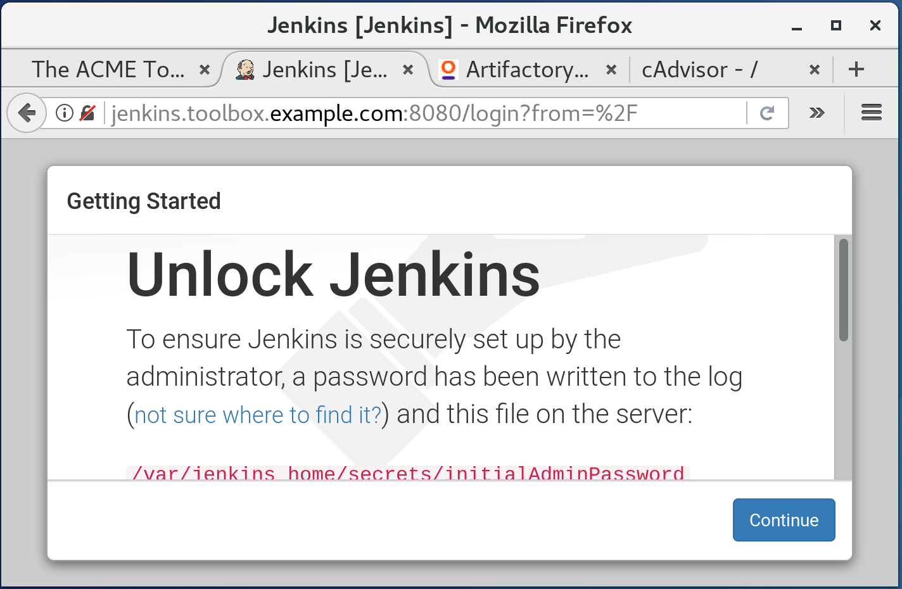
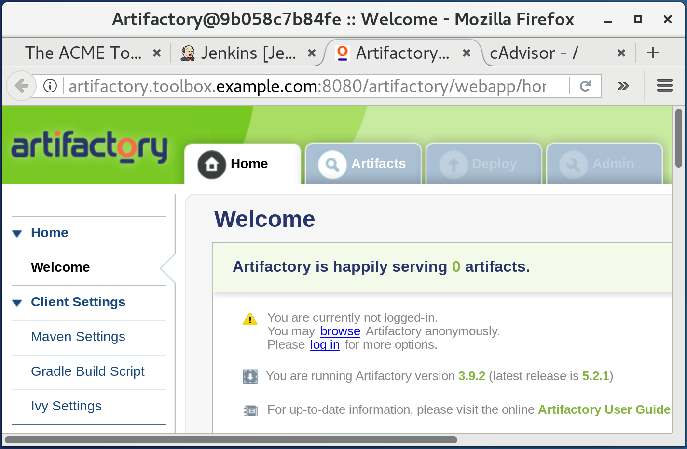

# OctoCop Directory for Docker (OCDD)
OctoCop DD or OCDD for short is a tool to make the life of IT administrators easy in situations when CoDers (like us) want to setup a CoDe (Continuous Deliver) server, serving mainly Jenkins and Artifactory. 

OCDD is not a proxy, and is not a load balancer. It is merely a traffic re-director - thus the name.

# The itch:
It started when a colleague of mine in Copenhagen described me a situation and wanted to have a solution for it. As a CoDer he had to provide (and setup) a server in some company which was supposed to run Jenkins, Artifactory and a few other software tools. The problem was that these tools were running on that server as Docker containers, and asking IT department to assign a IP address to these services and updating their DNS was proving to be a slow process. Also there were often times when a new service would be setup on the same server (as a Docker container), and again IT had to be involved. The idea was to have something in our control and not bother anybody from the IT department. It was also possible that some of the services would possibly have a port conflict with other ports on the same server, but changing port numbers for the conflicting services was not an option as it would prove to be to costly to maintain the host-container mapping. 

# The solution:
After banging my head with the problem for some time, I thought that I could sooth this itch by doing the following:
* Ask IT to assign one fixed IP address to the CoDe server, and have it registered in their DNS **once**.
* Ask IT for a new sub-domain of their current domain-name being used in their infrastructure - done **once**.
* Setup our CoDe server to be a authoritative name server for that  sub-domain obtained from the IT department - **once**.
* Ask IT to update their DNS server to forward all traffic for the above mentioned sub-domain to this CoDe server - **once**.
* Ask IT to provide you an unused **range of (private) IPs** from the scheme being used on the infrastructure - done **once**.
* Remove any host-container mapping from any docker / docker-compose application, and,
* Setup a new infrastructure IP on host's network interface for each container running on this server, and,
* Use iptables redirection rules to redirect incoming traffic on the network interface for each IP to a corresponding container.
* Setup DNS entries in our DNS server, for all these new IP addresses now setup on the host's network interface card.
* Add C-Advisor to see necessary resource utilization information about the host and containers.
* Automate all the tasks except those mentioning 'once' in this list.

And then, OCDD was born. 

# The working:
OCDD is actually a shell script, aptly named 'ocdd.sh', which can actually be considered as an add-on to your docker host serving as CoDe server. (You can actually use it in situations other than a pure CoDe server). By add-on, I mean that it will not affect any docker/compose application currently running on your server, with two exceptions:
* If you are running some DNS service listening on port 53(tcp,udp)
* If you are running some web service on port 80

You can either disable OCDD's internal web service completely in docker-compose or configure it to run on a different port. If you are running some DNS service on your CoDe server, then OCDD will not work for you, it's DNS service is at the heart of it's overall design.

So, what happens when you run OCDD? Well, first it initializes itself - which you have to do manually, the first time. Then, when run in the normal mode, it finds all the containers running on the Docker host, assigns an IP address from the unused range of IPs we know about - to the network interface of the server, sets up necessary iptables forwarding rules, and updates it's DNS zone file for the sub-domain it is responsible for. That's it!

You then access each service (running as a container) on the CoDe server, using it's DNS name or infrastructure IP from anywhere on the network. Part of the beauty of this design is that you can run whatever services you wish on the main docker host by mapping it to the host; because OCDD has nothing to do with the fixed infrastructure IP address assigned to our docker host. When you see it in action I am sure you will appreciate it!

The following are prerequisites for OCDD to work correctly on a Docker host:
* You can use root to setup OCDD.
* You can also use a normal user to set up OCDD. In that case the user needs to have password-less sudo access.
* In addition to having Docker / Docker-Engine and Docker-Compose, you need to have git (to download this repo - of-course), and [jq](https://stedolan.github.io/jq/download/).
* You need to setup a persistent storage location (with correct ownership/permissions) on your Docker host for DNS and www services which comes with OCDD. In my case it is `/opt/ocdd/` , which contains dns and www directories inside it. 
* You need to know the name of the sub-domain you want your DNS service to be authoritative for.
* You need to know the range of IPs you can use for your containers.

The `ocdd.conf` file helps you configure how `ocdd.sh` will behave.

Here is what my `ocdd.conf` file looks like:

```
[kamran@dockerhost OctoCopDD]$ egrep -v "\#|^$" ocdd.conf 
DEBUG=0
DOCKER_SOCKET='/var/run/docker.sock'
DOCKER_API_URL='http://localhost/containers/json'
NETWORK_DEVICE='ens3'
IP_SUBNET='192.168.122'
IP_RANGE_START=11
IP_RANGE_END=30
TOOLBOX_SUBDOMAIN_NAME='toolbox.example.com'
STORAGE_DIR=/opt/ocdd
DNS_ZONE_FILE=${STORAGE_DIR}/dns/toolbox.example.com.zone
WEB_INDEX_FILE=${STORAGE_DIR}/www/index.html
[kamran@dockerhost OctoCopDD]$ 
```


**DIAGRAM HERE**

# The examples:
Of-course you would like to see it in action by following some examples. I will surely do that for you.

## First, get the repo on the new server:

```
[kamran@dockerhost ~]$ git clone https://github.com/Praqma/OctoCopDD.git
[kamran@dockerhost ~]$ cd OctoCopDD
[kamran@dockerhost OctoCopDD]$
```

## Start the example application (Jenkins + Artifactory):
Assume you have some containers running on the CoDe server. If you do not have anything at all, don't worry; there is an example/ directory in the repository, which has a very simple / minimal docker-compose file, which starts an instance of Jenkins and Artifactory. Before doing anything OCDD specific we can start that. So here it goes:

```
[kamran@dockerhost OctoCopDD]$ cd example/

[kamran@dockerhost example]$ docker-compose up -d
Starting example_jenkins_1
Starting example_artifactory_1
[kamran@dockerhost example]$ 

[kamran@dockerhost example]$ docker-compose ps
        Name                       Command               State                 Ports                
---------------------------------------------------------------------------------------------------
example_artifactory_1   catalina.sh run                  Up      8080/tcp                           
example_jenkins_1       /bin/tini -- /usr/local/bi ...   Up      50000/tcp, 8080/tcp 
[kamran@dockerhost example]$ 
```

Notice that the ports of Jenkins or Artifactory are **not** mapped on the host. This is very important to note. 

## Initialize OCDD:
Change the directory back to the project root, and run `./ocdd initialize` .

```
[kamran@dockerhost example]$ cd ..

[kamran@dockerhost OctoCopDD]$ ./ocdd.sh initialize
Initializing OCDD ...
- Building fresh iplist.txt
- Removing OCDD specific iptables rules ...
- Removing additional IP addresses from the network interface - ens3 ...
- Removing services list from web server's index.html
- Stopping OCDD compose app (DNS, C-Advisor) ...

- Starting OCDD compose app (DNS, C-Advisor). This may take few minutes when run for the first time...
Recreating octocopdd_www_1
Recreating octocopdd_dns_1
Starting octocopdd_cadvisor_1

You can now run ./ocdd.sh without any parameters , so it could detect any running containers and does it's thing!

[kamran@dockerhost OctoCopDD]$ 
``` 


## Run the OCDD script in normal mode:
To see the real magic happening, run OCDD in normal mode. Simply execute `./ocdd.sh` :

```
[kamran@dockerhost OctoCopDD]$ ./ocdd.sh 

Found containers with following (docker-private) IP addresses:

dns 172.19.0.4
www 172.19.0.3
jenkins 172.18.0.3
cadvisor 172.19.0.2
artifactory 172.18.0.2

CONTAINER_COUNT on this docker host is 5 .


Generating iptables rules and DNS entries for each container...


Restarting octocopdd_dns_1 ... done
Restarting octocopdd_www_1 ... done

-------------------------------------------------------------------------------------

Here is how various hostnames and their IPs look like (in DNS) toolbox.example.com :

toolbox.example.com.	14400	IN	A	192.168.122.200
artifactory.toolbox.example.com. 14400 IN A	192.168.122.15
cadvisor.toolbox.example.com. 14400 IN	A	192.168.122.14
dns.toolbox.example.com. 14400	IN	A	192.168.122.11
dockerhost.toolbox.example.com.	14400 IN A	192.168.122.200
jenkins.toolbox.example.com. 14400 IN	A	192.168.122.13
www.toolbox.example.com. 14400	IN	A	192.168.122.12

[kamran@dockerhost OctoCopDD]$ 
```

While OCDD does it's thing, it also creates/updates the index.html file with the list of services. This is just in case someone tries to reach http://dockerhost.example.com. You can `curl` your localhost to get an idea about this web page.

```
[kamran@dockerhost OctoCopDD]$ curl localhost
<Title>The ACME ToolBox server</Title>
<H1>The ACME ToolBox server</H1>
<HR>

<br>* - dns.toolbox.example.com
<br>* - www.toolbox.example.com
<br>* - jenkins.toolbox.example.com
<br>* - cadvisor.toolbox.example.com
<br>* - artifactory.toolbox.example.com
[kamran@dockerhost OctoCopDD]$ 
```

That's it! Now lets access each service from a client computer and verify that we can indeed reach service using it's own DNS name.

## Access the web service of our dockerhost:
When you access the Docker host running OCDD, using it's fixed IP or the DNS name, you should be able to see the following:

**SCREENSHOT HERE**


## Access the jenkins service using it's own DNS name:
First notice that on a client computer, I am able to resolve `jenkins.toolbox.example.com` , where obviously `toolbox.example.com` is the sub-domain assigned to us.

```
[kamran@kworkhorse ~]$ dig jenkins.toolbox.example.com +short
192.168.122.13
[kamran@kworkhorse ~]$ 
```

Same goes for Artifactory:
```
[kamran@kworkhorse ~]$ dig artifactory.toolbox.example.com +short
192.168.122.15
[kamran@kworkhorse ~]$ 
```

Remember, you will need to specify the port of the service you are trying to access in addition to using it's DNS name. The design of OCDD is just to forward the traffic arriving at one infrastructure-IP and forward it to container IP, leaving the port to be used for the user. This allowed the OCDD's design to be much simpler.

So here is the screenshot that shows the Jenkins web page:



And here is the Artifactory web page:



# Summary:
OctoCopDD completely soothes this itch of how to have control on CoDe server or services, without routinely bothering (read: bugging) IT department of an organization. The project is accessible through [https://github.com/praqma/octocopdd](https://github.com/praqma/octocopdd) , and following our agile principle of *Continuous Improvement*, is a work in progress - though production ready. I hope you will enjoy deploying and using it as much as I did while developing it.
